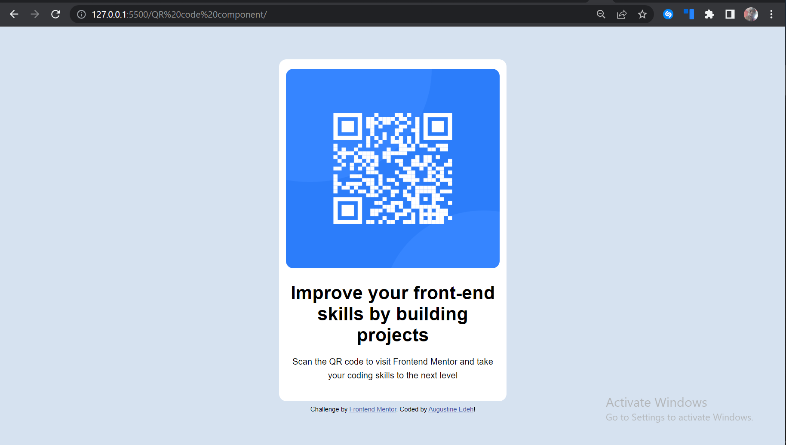
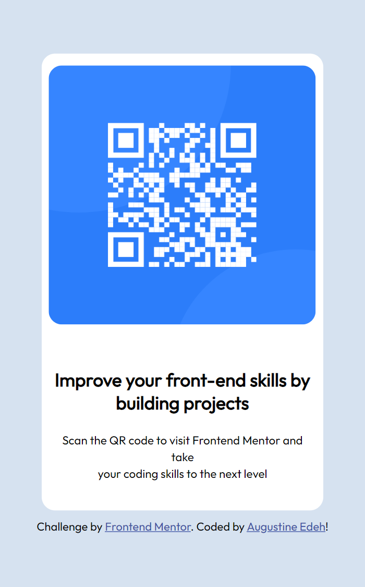

# Frontend Mentor - QR code component solution

This is a solution to the [QR code component challenge on Frontend Mentor](https://www.frontendmentor.io/challenges/qr-code-component-iux_sIO_H). Frontend Mentor challenges help you improve your coding skills by building realistic projects.

## Table of contents

- [Frontend Mentor - QR code component solution](#frontend-mentor---qr-code-component-solution)
  - [Table of contents](#table-of-contents)
  - [**Overview**](#overview)
    - [Screenshots:](#screenshots)
    - [**Links**](#links)
  - [**My process**](#my-process)
    - [Built with](#built-with)
    - [What I learned](#what-i-learned)
    - [Continued development](#continued-development)
  - [Plans for continued development](#plans-for-continued-development)
    - [Useful resources](#useful-resources)
  - [Author](#author)
  - [Acknowledgments](#acknowledgments)

## **Overview**

### Screenshots:

(Desktop View)


(Mobile View)


### **Links**

- Solution URL: [Go to gitHub solution Repository](https://github.com/Augustine-edeh/QR-code-component--FrontEndMentor.io-challenge--)
- Live Site URL: [View live site](https://augustine-edeh.github.io/QR-code-component--FrontEndMentor.io-challenge--/)

## **My process**

### Built with

- Semantic HTML5 markup
- CSS custom properties
- CSS custom Styles
- CSS Grid
- Desktop-first workflow

### What I learned

- I learned the concept of Mobile-first design/development
- Was able to reinforced my knowledge of CSS Media queries, for implementing responsive features/layouts for mobile devices.

**Below is an excerpt of the CSS media query code/syntax I used in implementing the responsive features of this project:**

```css
@media screen and (max-width: 375px) {
}
```

### Continued development

## Plans for continued development

I hope to in the future, focus and refine my skills in the front-end development field and also master the concepts of responsive designs, concepts of of semantics in HTML as well as accessibility and other key concepts/knowledge required in becoming a world class in front-end development.

### Useful resources

- [MDN Media queries Documentation](https://developer.mozilla.org/en-US/docs/Learn/CSS/CSS_layout/Media_queries) - This is an amazing article which helped me finally understand **CSS Media queries**. I'd recommend it to anyone still learning this concept.

## Author

- Portfolio - [Go to my portfolio](https://augustine-edeh.github.io/My-Portfolio/)
- GitHub - [@Augustine-edeh](https://github.com/Augustine-edeh)
- Frontend Mentor - [@yourusername](https://www.frontendmentor.io/profile/Augustine-source)
- Twitter - [@Augustine_edeh](https://twitter.com/Augustine_edeh)
- LinkedIn - [@Augustine Edeh](https://www.linkedin.com/in/augustine-edeh/)

## Acknowledgments

I want to acknowledge Myself (Augustine Edeh) for completing this project and continuing to improve my experience and skills in frontend development. Thank you for the perseverance. I will one day look back at the journey and thank myself for not giving up and following my dreams above all.🚀

\- Augustine Edeh -S.

(20th January, 2023)
